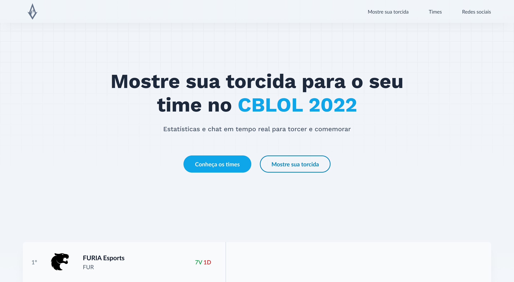

# League of byron

Mostre sua torcida para o seu time no CBLOL 2022

> Projeto final para o processo trainee da EJ byron.solutions

---

## Índice

- [Ideia](#ideia)
- [Design](#design)
- [Tecnologias Utilizadas](#tecnologias-utilizadas)
- [Como rodar o projeto](#como-rodar-o-projeto)
- [Equipe](#equipe)

## Ideia

Esta é uma landing page criada como projeto para o processo trainee da EJ byron.solutios.

A dupla foi instruída a fazer um trabalho que utilizasse as tecnologias aprendidas na capacitação do processo trainee e, assim, criou um app fictício de chat e estatísticas para o Campeonato Brasileiro de League of Legends (CBLOL)

## Design

O design da interface foi feito por meio da utilização da ferramenta de prototipação Figma. Porém o mesmo não está completo devido aos atrasos para o desenvolvimento e a priorização da entrega.

Acesse o projeto no Figma (WIP) [clicando aqui](https://www.figma.com/file/kJ1Qp38E62v6dv5SjuVGR8/Ieague-of-byron?node-id=115%3A9)

## Tecnologias Utilizadas

Foram utilizadas as tecnologias aprendidas na capacitação do processo trainee, com a adição do Svelte e do Tailwind CSS

- HTML, CSS, Javascript
- Svelte
- Tailwind CSS
- Bootstrap

## Como rodar o projeto

Para rodar o projeto, primeiro é preciso cloná-lo em sua máquina local. Para fazer isso, insira no terminal (na pasta de destino desejada)

> git clone https://github.com/joevtap/projeto-final-byron.git

Depois de clonar, navegue até a raíz do projeto

> cd projeto-final-byron

Instale as dependências com

> npm install

Inicie o servidor de desenvolvimento com

> npm run dev

### Preview

Você também pode acessar o preview do projeto [clicando aqui](https://projeto-final-byron.vercel.app/)

## Equipe

- [Ana Maísa](https://github.com/AnaMaisaUnifei)
- [Joel Vítor](https://github.com/joevtap)
